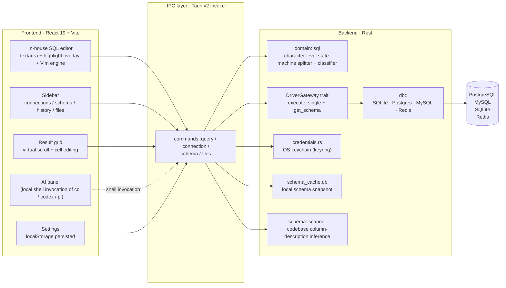

# sql-editor — A stable, extensible data query tool

> A core-stable, extensible, local-first data query tool focused on **managing your data sources**. Built on Tauri v2 + Rust, with resource usage far below Electron-class alternatives.
> Three pillars: **extensible query engine**, **data source management**, **seamless Agent integration**. Currently supports PostgreSQL / MySQL / SQLite / Redis.

[中文版](./README.md) | English

[](./LICENSE)
[](./.github/workflows/ci.yml)

## Preview


> Above: in-house SQL editor (syntax highlighting + Vim normal mode) + multi-statement results + primary-key-driven cell editing.
> All screenshots live in [`docs/images/`](./docs/images) and are generated by `tests/screenshots.spec.ts` using Playwright + mock IPC.

| | |
|:---:|:---:|
|  |  |
| Sidebar connection items ⋯ menu + expanded schema tree | Vim normal / insert / operators WIP |

| | |
|:---:|:---:|
|  |  |
| Multi-type connection form | Keywords / strings / numbers coloured per token |

> Generated by `tests/gif.spec.ts` with Playwright + ffmpeg. Refresh with `GIF=1 pnpm exec playwright test tests/gif.spec.ts`.

## Platform Architecture

This project is designed as a **platform**, not a tool, around three pillars:

### 1. Extensible Query Engine

A unified query / schema introspection interface. Adding a new backend means implementing one driver; the editor, autocomplete, and result grid light up automatically:

- Built-in: SQLite (rusqlite), PostgreSQL, MySQL (sqlx), Redis
- **Driver trait done**: unified `DriverGateway` interface (`execute_single` / `get_schema`), with multi-statement orchestration (`execute_multi_query`) shared. New drivers only implement the trait.

### 2. Data Source Management

Treat "connection + credential + schema + query history" as first-class citizens; everything is isolated per connection:

- Connections: local list + credentials in the OS keychain (macOS Keychain / Windows Credential Manager / Linux libsecret)
- Schema: local SQLite cache + codebase column-description inference, browseable offline
- Query history: per-connection `.sql` files, auto-saved to `app_data_dir/queries/<connection>/`
- Cell editing: double-click → primary-key-driven `UPDATE` generated automatically
- All UI operations stay local; zero telemetry

### 3. Seamless Agent Integration

Turn the query tool into an Agent-friendly subprocess / HTTP endpoint so Claude Code / Codex / pi and other Agents can drive it:

- **Local shell invocation** (preferred): drive sql-editor as a command — SQL and parameters on stdin, structured results on stdout
- **HTTP endpoint** (optional): expose a local service port for Agents to query remotely
- **Structured output**: JSON / TSV / Markdown table selectable — no useless escaping
- **Agent-first error design**: error messages tuned for LLMs (with type, column, row hints) so Agents can self-correct

## System Architecture



## Features

- **In-house SQL editor**: textarea + syntax highlight overlay, with a built-in Vim engine (normal / insert / visual / pending)
- **Schema autocomplete**: tables / columns / keywords / functions, with `table.column` dot context
- **Multi-statement execution**: character-level state-machine splitter, executes statements one by one and aggregates results
- **Schema cache**: local SQLite snapshot of database schema, offline browsing + column-description scanning (inferred from your codebase)

## Security Model

Please read this section — it determines how your data is handled.

| Data | Storage | Notes |
|------|----------|-------|
| Database connection credentials (passwords) | **OS keychain** (macOS Keychain / Windows Credential Manager / Linux libsecret) | Passwords **never** written to localStorage or plaintext files (passwords in URL connection strings are also stripped before persistence) |
| Connection metadata (host/port/user/db) | App data directory + localStorage | No passwords |
| Schema snapshots | `app_data_dir/schema_cache.db` (local SQLite) | Local only |
| Query files (`.sql`) | `app_data_dir/queries/<connection>/` | Isolated per connection |

**Network behavior:**
- Queries go directly to your configured database (TLS on demand; recommended for production)
- The application itself does not send telemetry to any third-party service

**Execution boundary:** This tool executes arbitrary queries as you input them (that's the job of a query client). Only connect to databases you have permission to access.

## Database Support

| Database | Status | Driver |
|----------|--------|--------|
| SQLite | ✅ Full | rusqlite (bundled) |
| PostgreSQL | ✅ Full | sqlx + rustls |
| MySQL | ✅ Full | sqlx + rustls |
| Redis | ✅ Usable (known limits) | redis (tokio-comp) |

> See [docs/ARCHITECTURE.md](./docs/ARCHITECTURE.md) for the work involved in adding a new database.

## Install & Build

### Prerequisites

- [Node.js](https://nodejs.org/) ≥ 20 + [pnpm](https://pnpm.io/)
- [Rust](https://www.rust-lang.org/tools/install) (stable)
- Tauri v2 system deps: [follow the official guide](https://v2.tauri.app/start/prerequisites/)

### Development

```bash
pnpm install
pnpm run tauri dev
```

### Production build

```bash
pnpm run tauri build
```

Artifacts end up in `src-tauri/target/release/bundle/`.

## Project Structure

```
src/                     # Frontend (TypeScript + React 19 + Vite)
├── editor/              # In-house editor (highlight, Vim engine, statement extraction)
├── components/          # UI components (ResultGrid, ConnectionDialog, Sidebar…)
│   ├── results/         # Result renderers (JSON, etc.)
│   └── ui/              # Radix UI wrappers (Dialog / DropdownMenu / Toast / Tooltip…)
├── domain/              # Domain models (connection, result set)
├── hooks/               # useConnection / useQuery / useTabStore / useSchema…
├── lib/                 # IPC / credentials / schema-source / tokens
└── styles/              # CSS (split per component)

src-tauri/src/           # Backend (Rust)
├── db/                  # Drivers: sqlite / postgres / mysql / redis + split_sql state machine
├── schema/              # Introspection / cache / codebase scanning
├── credentials.rs       # OS keychain access
├── application/         # Ports + orchestration (DriverGateway trait)
├── commands/            # Tauri commands: connection / query / schema / files
└── domain/              # Pure SQL domain primitives (splitter / classifier)
```

See [docs/ARCHITECTURE.md](./docs/ARCHITECTURE.md) for details.

## Roadmap

- [ ] **CRUD SQL generation complete**: row-level `INSERT` / `DELETE`, change preview/confirm
- [ ] **Result component configuration**: JSON / table / chart renderers, registration mechanism
- [ ] **Agent integration**: local shell invocation (e.g. `cc` / `codex` / `pi`), no external traffic (product form and boundaries TBD)
- [ ] **Keybinding layer**: data-driven key→action mapping
- [ ] **Settings center**: theme, font, unified persistence
- [ ] **Light/dark theme switch**: tokens ready, `[data-theme]` scope pending

## Why not VSCode? Why build our own?

| Dimension | VSCode + SQL extensions | This project |
|---|---|---|
| Resource usage | Electron, ~300–500 MB RAM resident | Tauri v2 + Rust backend, ~30–80 MB |
| Multi-database | Each extension is isolated, fragmented UX | Unified `DriverGateway` trait — UI / autocomplete / result grid share code |
| Query-first UI | Generic editor + plugin-style autocomplete | Database-first: sidebar connections + schema tree + result grid + cell editing |
| Agent-friendly | No standard interface | Shell invocation + structured output, Agents can call directly |
| Credential safety | Stored in settings.json or extension-specific | OS keychain, URL passwords stripped automatically, zero localStorage |

The main argument: **VSCode is a general editor trying to host database queries**. We want a **core-stable data query tool** — Tauri + Rust gives us ~30 MB RAM + near-native speed, and `DriverGateway` trait means extensibility is no worse than the extension ecosystem.

## Development Guide

```bash
cd src-tauri && cargo build     # Build backend
cd src-tauri && cargo test      # Run backend tests
pnpm run dev                     # Start Vite dev server
pnpm test                        # Run E2E (Playwright)
pnpm run build                   # Production build
SCREENSHOTS=1 pnpm test tests/screenshots.spec.ts   # Regenerate docs/images/*.png
GIF=1 pnpm exec playwright test tests/gif.spec.ts   # Regenerate docs/images/highlight.gif
```

Coding conventions in [CLAUDE.md](./CLAUDE.md) (immutable data, files < 400 lines, functions < 50 lines).

## Contributing

Issues and PRs welcome. Before submitting:

1. `cd src-tauri && cargo test` passes
2. `pnpm run build` passes (including `tsc` type checking)
3. Follow existing code style and immutable data patterns
4. User-facing text in English (or matching the existing surface)

## License

[MIT](./LICENSE)
