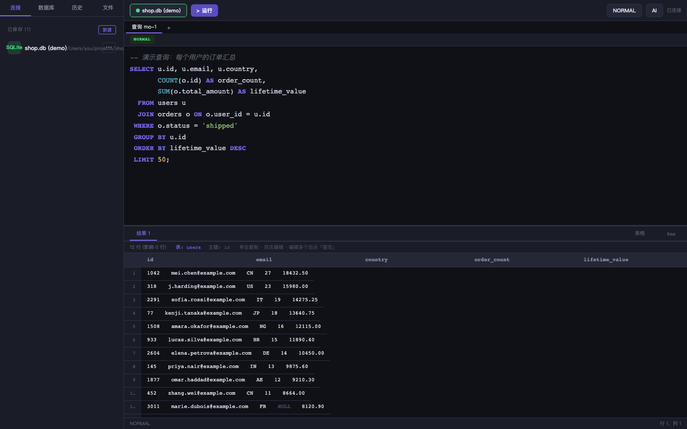
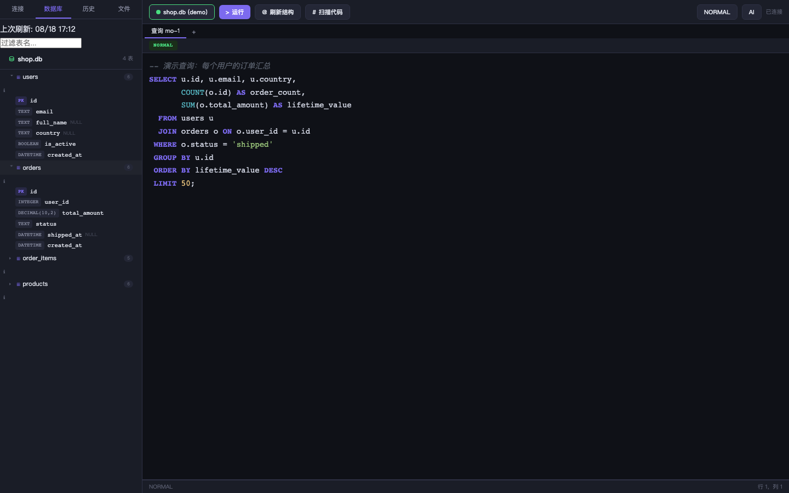
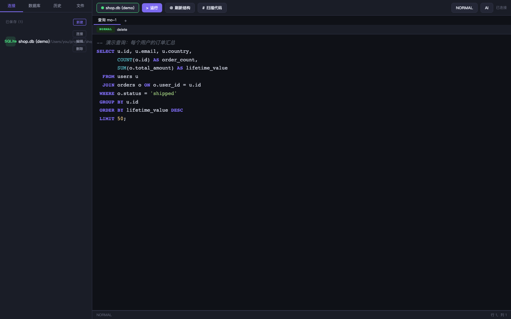
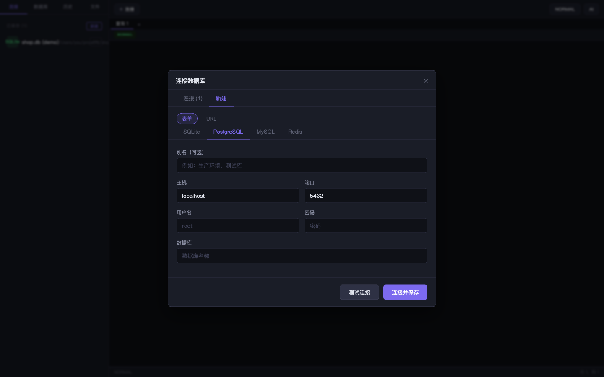
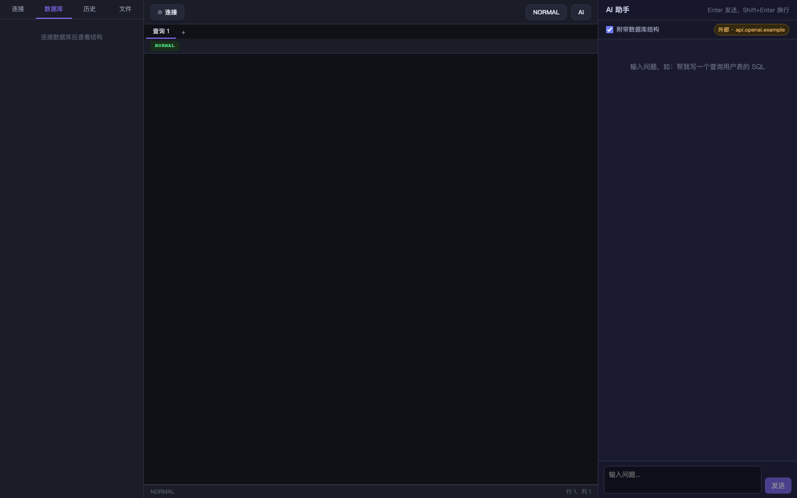
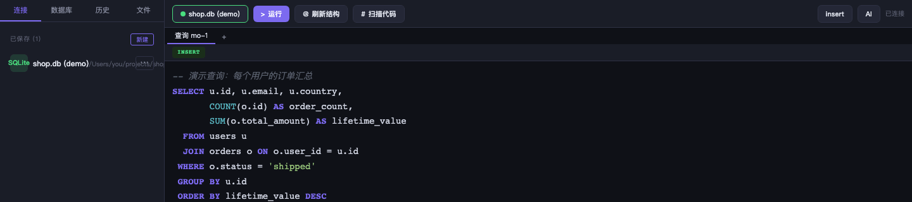
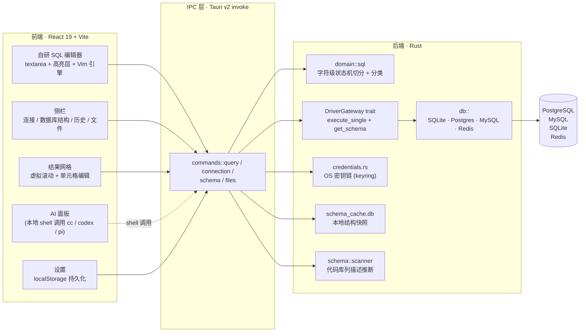

# sql-editor — 本地优先的数据查询平台

> 一款面向开发者的本地优先（local-first）数据查询平台，基于 Tauri v2 构建。不止是 SQL 编辑器：**可扩展的查询引擎**、**可定制的结果组件**、**CRUD SQL 自动生成**。目前支持 PostgreSQL / MySQL / SQLite / Redis。

[](./LICENSE)
[](./.github/workflows/ci.yml)

## 预览



> 上图：自研 SQL 编辑器（语法高亮 + Vim normal 模式）+ 多语句结果 + 主键驱动单元格编辑。
> 全部截图位于 [`docs/images/`](./docs/images)，由 `tests/screenshots.spec.ts` 用 Playwright + mock IPC 生成。

| | |
|:---:|:---:|
|  |  |
| 侧栏连接项 ⋯ 菜单 + 展开的数据库结构 | Vim normal / insert / 算子待发 |

| | |
|:---:|:---:|
|  |  |
| 多类型连接表单 | AI 集成（待实现，见 Roadmap） |

### 语法高亮



> 上图：键入 SQL 时关键字 / 字符串 / 数字 / 标识符逐 token 实时着色。
> 由 `tests/gif.spec.ts` 用 Playwright + ffmpeg 生成，跑 `GIF=1 pnpm exec playwright test tests/gif.spec.ts` 可重拍。

## 平台架构

本项目按"平台"而非"工具"设计，三条核心支柱：

### 1. 查询引擎可扩展

统一的查询 / Schema 内省接口，新增一种后端只需实现一个驱动，前端编辑器、补全、结果网格随即可用：

- 已内置：SQLite（rusqlite）、PostgreSQL、MySQL（sqlx）、Redis
- **Driver trait 化已完成**：统一接口 `DriverGateway`（`execute_single` / `get_schema`），多语句编排 `execute_multi_query` 共享；新增驱动只需实现 trait。

### 2. 页面组件可定制

结果展示与数据操作以组件方式组织，可按数据形态定制呈现：

- 已内置：虚拟滚动结果网格、多结果 Tab、单击复制、单元格直接编辑
- Roadmap：结果渲染器配置（JSON / 表格 / 图表）、组件注册机制

### 3. CRUD SQL 自动生成

数据变更操作由平台生成 SQL，避免手写易错语句：

- 已内置：双击单元格编辑值 → 按主键自动生成 `UPDATE`
- Roadmap：行级 `INSERT` / `DELETE` 生成、变更预览确认

## 系统架构图



## 特性

- **自研 SQL 编辑器**：基于 textarea + 语法高亮层，内置 Vim 模式引擎（normal/insert/visual/pending）。
- **Schema 自动补全**：表名 / 列名 / 关键字 / 函数，支持 `表.列` 点号上下文。
- **多语句执行**：字符级状态机切分 SQL，逐条执行并聚合结果。
- **Schema 缓存**：本地 SQLite 缓存数据库结构快照，离线浏览 + 列描述扫描（从代码库推断列含义）。

## 安全模型

请务必阅读本节——它决定了你的数据如何被处理。

| 数据 | 存储位置 | 说明 |
|------|----------|------|
| 数据库连接凭证（密码） | **操作系统密钥链**（macOS Keychain / Windows Credential Manager / Linux libsecret） | 密码**绝不**写入 localStorage 或明文文件（URL 连接串中的密码也会在持久化前剥离） |
| 连接元数据（host/port/user/db） | 应用数据目录 + localStorage | 不含密码 |
| Schema 快照 | `app_data_dir/schema_cache.db`（本地 SQLite） | 仅本地 |
| 查询文件（`.sql`） | `app_data_dir/queries/<连接>/` | 按连接隔离 |

**网络行为：**
- 查询直连你指定的数据库（按需 TLS，建议生产库启用）。
- 应用本身不向任何第三方服务发送遥测。

**执行边界：** 本工具按用户输入执行任意查询（这是查询客户端的本职）。请只连接你有权访问的数据库。

## 数据库支持

| 数据库 | 状态 | 驱动 |
|--------|------|------|
| SQLite | ✅ 完整 | rusqlite（bundled） |
| PostgreSQL | ✅ 完整 | sqlx + rustls |
| MySQL | ✅ 完整 | sqlx + rustls |
| Redis | ✅ 可用（已知限制） | redis（tokio-comp） |

> 新增数据库类型的工作量见 [docs/ARCHITECTURE.md](./docs/ARCHITECTURE.md)。

## 安装与构建

### 前置要求

- [Node.js](https://nodejs.org/) ≥ 20 + [pnpm](https://pnpm.io/)
- [Rust](https://www.rust-lang.org/tools/install)（stable）
- Tauri v2 系统依赖：[按官方指南安装](https://v2.tauri.app/start/prerequisites/)

### 开发

```bash
pnpm install
pnpm run tauri dev
```

### 生产构建

```bash
pnpm run tauri build
```

产物在 `src-tauri/target/release/bundle/`。

## 项目结构

```
src/                     # 前端（TypeScript + React 19 + Vite）
├── editor/              # 自研编辑器（高亮、Vim 引擎、语句提取）
├── components/          # UI 组件（ResultGrid、ConnectionDialog、Sidebar…）
│   ├── results/         # 结果渲染器（JSON 等）
│   └── ui/              # Radix UI 封装（Dialog / DropdownMenu / Toast / Tooltip…）
├── domain/              # 领域模型（连接、结果集）
├── hooks/               # useConnection / useQuery / useTabStore / useSchema…
├── lib/                 # IPC / 凭证 / schema-source / tokens
└── styles/              # CSS 样式（按组件拆分）

src-tauri/src/           # 后端（Rust）
├── db/                  # 驱动：sqlite / postgres / mysql / redis + split_sql 状态机
├── schema/              # 内省 / 缓存 / 代码库扫描
├── credentials.rs       # OS 密钥链存取
├── application/         # ports + 编排（DriverGateway trait）
├── commands/            # Tauri 命令：connection / query / schema / files
└── domain/              # 纯 SQL 域原语（splitter / classifier）
```

详见 [docs/ARCHITECTURE.md](./docs/ARCHITECTURE.md)。

## Roadmap

- [ ] **CRUD SQL 生成完整化**：行级 `INSERT` / `DELETE`、变更预览确认
- [ ] **结果组件配置**：JSON / 表格 / 图表渲染器，组件注册机制
- [ ] **AI 集成**：本地 shell 调用 Agent（如 `cc` / `codex` / `pi`），全程不外发（产品形式与边界 TBD）
- [ ] 快捷键配置层（数据驱动 key→action 映射）
- [ ] 设置中心（主题、字体统一持久化）
- [ ] 明暗主题切换（token 已就绪，待加 `[data-theme]` 作用域）

## 开发指南

```bash
cd src-tauri && cargo build     # 构建后端
cd src-tauri && cargo test      # 运行后端测试
pnpm run dev                     # 启动 Vite dev server
pnpm test                        # 运行 E2E（Playwright）
pnpm run build                   # 生产构建
SCREENSHOTS=1 pnpm test tests/screenshots.spec.ts   # 重新生成 docs/images/*.png
```

代码规范见 [CLAUDE.md](./CLAUDE.md)（不可变数据、文件 < 400 行、函数 < 50 行、用户面文本中文化）。

## 贡献

欢迎 Issue 和 PR。提交前请确保：

1. `cd src-tauri && cargo test` 通过
2. `pnpm run build` 通过（含 `tsc` 类型检查）
3. 遵循现有代码风格与不可变数据模式
4. 用户面文本使用中文

## License

[MIT](./LICENSE)
